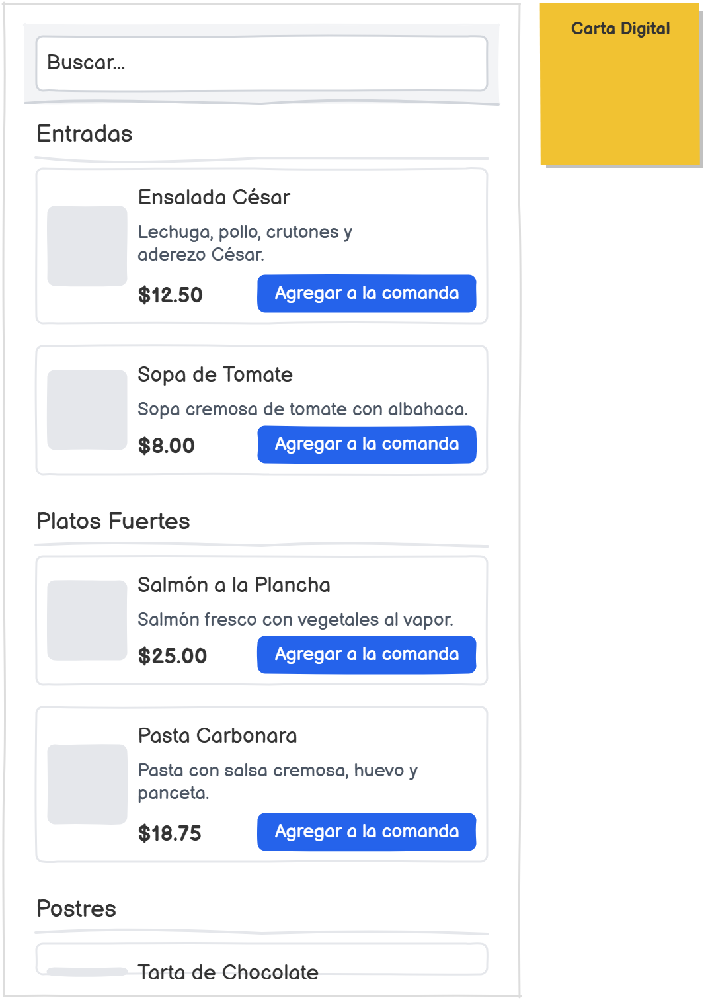
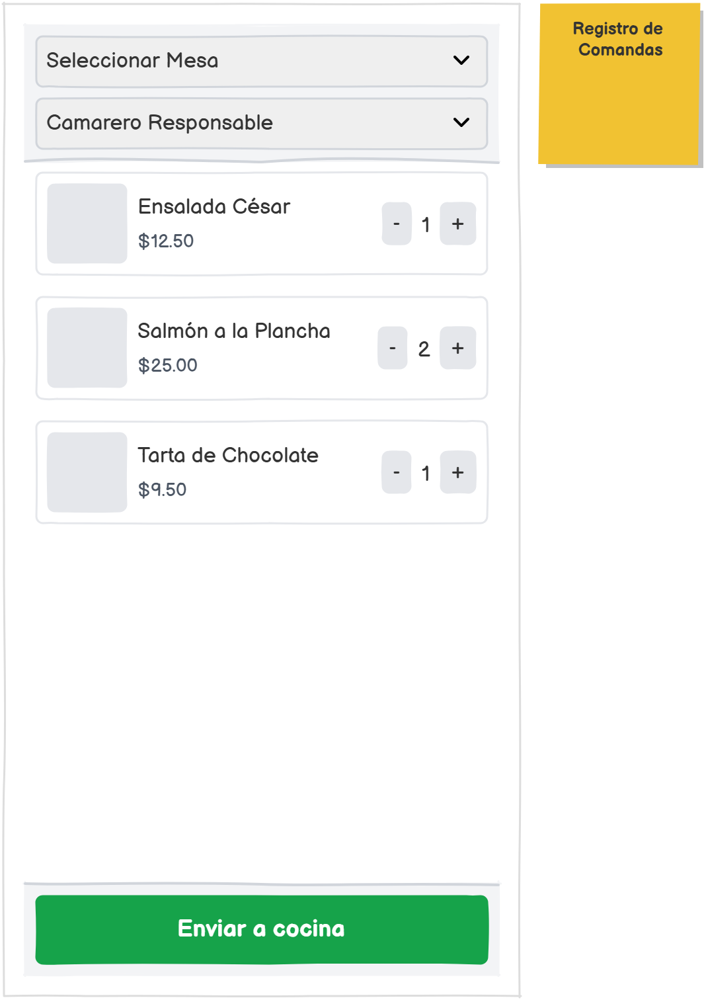
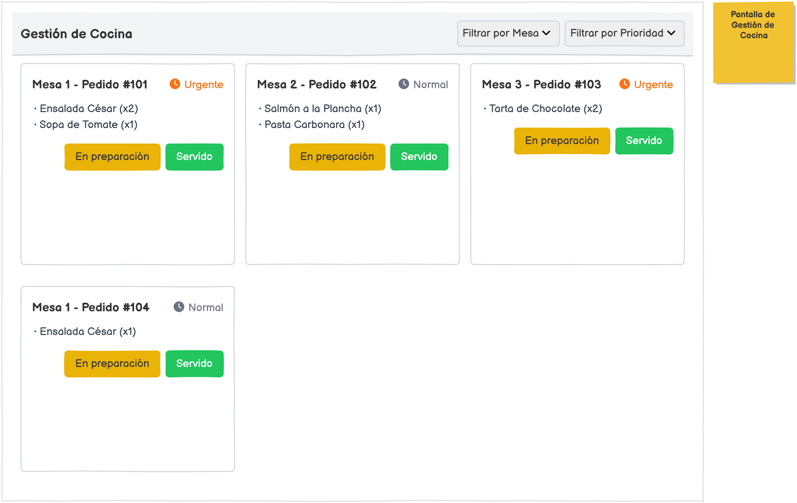

# Entregable RA2 — Diseño del Proyecto
### Módulo: Proyecto de Desarrollo de Aplicaciones Web · Curso 2025-2026

---

## Datos del grupo

| Campo | Valor |
|---|---|
| Grupo DCK | |
| Karim | |
| David Corbalán | |
| Curra R. Bermúdez | |
| 5 / 03 / 2026 | |

---

## Distribución de tareas

> **Norma de obligado cumplimiento**: cada tarea debe tener **un único responsable** identificado por nombre. No se acepta "todos", "el grupo" ni cualquier respuesta equivalente. El profesor evaluará cada tarea teniendo en cuenta quién la ha firmado.
>
> Conserva únicamente la tabla que corresponda al tamaño de tu grupo. Elimina las otras dos antes de entregar.

---


### Tabla B — Grupo de 3 miembros · reparto al 33 % (~3-4 tareas por miembro)

| N.º | Tarea | Responsable |
|:---:|---|---|
| 1 | Brief del proyecto | Karim |
| 2 | Tabla de usuarios y permisos | David |
| 3 | Tabla de viabilidad | Curra |
| 4 | Tabla de decisión de tecnologías | Karim |
| 5 | Objetivos y alcance del proyecto | David |
| 6 | Definición del MVP | Curra |
| 7 | Fases del proyecto | Karim |
| 8 | Backlog de historias de usuario | Curra |
| 9 | Dossier de diseño | Curra |
| 10 | Registros de decisión (ADR) y pruebas de concepto | David |

> *Reparto propuesto: 4-3-3 tareas. Dado que la tarea 9 es la más extensa, quien la asuma tiene una carga equivalente a dos tareas normales. El grupo puede reorganizar el reparto para equilibrar el esfuerzo, manteniendo siempre un único responsable por tarea.*


---

## Tarea 1 — Brief del proyecto

**Responsable:** *(Karim)*

**Enunciado:**  
Redacta el Brief de tu proyecto. Se trata del documento de partida que define con precisión el problema que queréis resolver y el sistema que vais a construir. Debe incluir todos los elementos siguientes:

- **Contexto y objetivo del negocio**: ¿qué quiere mejorar el cliente o usuario y por qué ahora?  
- **Usuarios y roles**: ¿quién va a usar el sistema? ¿quién lo administra?  
- **Flujos principales**: describe las 2–4 tareas clave que deben funcionar sí o sí (el "recorrido feliz").  
- **Datos**: ¿qué información se guarda? ¿quién la consulta? ¿cuánto tiempo se conserva?  
- **Restricciones**: tiempo disponible, dispositivos, conectividad, presupuesto, requisitos legales.  
- **Suposiciones y dudas**: cosas que todavía no sabéis y que deberéis resolver antes de diseñar.  
- **Criterios de éxito**: al menos 3 afirmaciones verificables (no palabras vagas) que definan cuándo el proyecto ha funcionado.

*Extensión orientativa: 1–3 páginas.*

---

**Entrega:**


### Contexto y objetivo del negocio

En muchos restaurantes pequeños y medianos, la gestión de comandas e inventario todavía se realiza de forma manual o mediante sistemas poco integrados. Es habitual que los camareros anoten pedidos en papel o en sistemas básicos que no se comunican automáticamente con cocina ni con el inventario.

Esta situación genera:

Errores en los pedidos (productos incorrectos o duplicados).

Retrasos en cocina por falta de coordinación.

Descontrol del stock disponible.

Pérdida de tiempo en tareas administrativas.

Dificultad para obtener información clara sobre ventas diarias.

El contexto actual del sector hostelero, cada vez más competitivo y digitalizado, hace necesario optimizar procesos internos para mejorar la eficiencia y reducir costes operativos.

El objetivo del proyecto es desarrollar una aplicación web de gestión interna para restaurante que permita digitalizar el proceso de toma de comandas, automatizar la comunicación con cocina y actualizar el inventario en tiempo real, reduciendo errores y mejorando la organización del negocio.

### Usuarios y roles

El sistema contará con los siguientes tipos de usuario:

1. Administrador

Gestiona usuarios del sistema.

Da de alta, modifica o elimina productos del menú.

Consulta el inventario.

Supervisa el estado de los pedidos.

Puede modificar manualmente el stock si es necesario.

2. Camarero

Consulta la carta digital.

Registra comandas asociadas a una mesa.

Envía pedidos a cocina.

Consulta el estado del pedido (pendiente, en preparación, servido).

3. Personal de cocina

Visualiza los pedidos recibidos.

Cambia el estado del pedido (pendiente → en preparación → servido).

No tiene acceso a datos de administración ni inventario completo.

Cada usuario accede mediante autenticación con credenciales propias y permisos diferenciados.

### Flujos principales (recorrido feliz)

1. - Registro de comanda

El camarero inicia sesión.

Selecciona una mesa.

Añade productos desde la carta digital.

Confirma el pedido.

El sistema registra la comanda y la envía automáticamente a cocina.

El stock de cada producto se descuenta automáticamente.

2. - Gestión de pedidos en cocina

El personal de cocina inicia sesión.

Visualiza los pedidos pendientes.

Cambia el estado a “en preparación”.

Una vez terminado, cambia el estado a “servido”.

El camarero puede ver el nuevo estado en su dispositivo.
3. - Gestión de inventario

El administrador accede al panel.

Consulta el listado de productos con su stock actual.

Modifica manualmente el stock si es necesario.

Puede añadir o eliminar productos del sistema.


### Datos del sistema

El sistema gestionará los siguientes datos:

- Datos de usuarios

        - Nombre de usuario.

        - Rol (administrador, camarero, cocina).

        - Contraseña cifrada.

        - Fecha de creación.

Acceso: solo el administrador puede gestionar usuarios.

- Datos de productos

        - Nombre del producto.

        - Categoría.

        - Precio.

        - Stock disponible.

        - Estado (activo/inactivo).

Acceso:

Camarero: solo lectura.

Cocina: solo lectura.

Administrador: crear, modificar y eliminar.

- Datos de comandas

        - Número de mesa.

        - Lista de productos.

        - Cantidad.

        - Fecha y hora.

        - Estado del pedido.

        - Usuario que registra la comanda.

Acceso:

Camarero: crea y consulta.

Cocina: consulta y actualiza estado.

Administrador: consulta global.

- Datos sensibles

        - Credenciales de acceso de los usuarios.

        - Posible información de empleados.

Las contraseñas se almacenarán cifradas y el acceso estará protegido por HTTPS.

### Restricciones

- Tiempo

50 horas de desarrollo distribuidas en 4–6 semanas.

- Dispositivos

Tablets para camareros.

Ordenador o pantalla para cocina.

Navegador web estándar.

- Presupuesto

Uso de herramientas gratuitas o educativas.

Hosting gratuito o de bajo coste.

Sin desarrollo de aplicación móvil nativa.

- Conectividad

Requiere conexión a red local o internet estable.

- Requisitos legales

Cumplimiento del Reglamento General de Protección de Datos (RGPD).

Uso obligatorio de HTTPS.

Control de acceso por roles.

### Suposiciones y dudas abiertas

- Suposición 1

Se asume que el restaurante dispone de conexión WiFi estable en todas las áreas (sala y cocina).

- Suposición 2

Se asume que el restaurante tiene un número reducido de mesas (ejemplo: menos de 30), lo que evita problemas de alto volumen simultáneo.

- Dudas abiertas

¿Es necesaria la persistencia histórica de ventas durante años o solo un periodo limitado?

¿Se requiere integración futura con sistemas de facturación o TPV externos?

¿Es imprescindible actualización en tiempo real mediante WebSockets o es suficiente una actualización automática cada pocos segundos?

### Criterios de éxito (verificables)

| Criterio | Cómo se verifica |
|---|---|
|1. El sistema permite registrar una comanda y enviarla a cocina en menos de 30 segundos. |Prueba práctica cronometrada con un camarero simulado. |
| 2. El stock se descuenta automáticamente al confirmar una comanda y no permite valores negativos.|Test funcional donde se intenta vender más unidades de las disponibles. |
|3. Cada usuario solo puede acceder a las funcionalidades de su rol. |Prueba de acceso con distintos perfiles y verificación de restricciones. |
|4. La aplicación funciona correctamente en tablet (interfaz responsive).|Prueba en dispositivo móvil o simulador con distintas resoluciones.|
|5. La comunicación se realiza mediante HTTPS en el entorno de despliegue.|Verificación del certificado en el navegador.|


---

## Tarea 2 — Tabla de usuarios y permisos

**Responsable:** David

**Enunciado:**  
Identifica todos los roles de usuario del sistema y completa la tabla. Para cada rol debes responder cuatro preguntas: ¿qué intenta lograr ese usuario?, ¿qué acciones puede realizar (crear, leer, editar, borrar)?, ¿qué datos sensibles maneja? y ¿qué consecuencias tiene un fallo para ese usuario?

Asegúrate de incluir al menos tres roles distintos. A continuación, para cada rol, convierte un posible riesgo de fallo en un requisito del sistema con la forma: *"El sistema debe impedir que…"*

---

**Entrega:**

| Rol / usuario | ¿Qué intenta lograr? | ¿Qué puede hacer? (C / R / E / B) | ¿Qué datos sensibles maneja? | ¿Qué pasa si algo falla? |
|---|---|---|---|---|
| Administrador |Supervisar el funcionamiento del sistema, gestionar productos, usuarios e inventario. |Usuarios: C / R / E / B Productos: C / R / E / B Inventario: R / E  Comandas: R | Credenciales de usuarios, información de empleados, datos de ventas e inventario.|Pérdida o corrupción de datos, eliminación accidental de usuarios o productos, descontrol total del sistema. |
| Camarero |Registrar comandas correctamente y enviarlas a cocina de forma rápida. |Comandas: C / R / E Productos (carta): R / E | Información de pedidos en curso y número de mesa asociado.|Errores en pedidos, retrasos en servicio, pérdida de ventas o conflictos con clientes. |
| Personal de cocina |Visualizar pedidos pendientes y actualizar su estado hasta completarlos. |Comandas: R / E (estado del pedido) | Información de pedidos activos.|Pedidos no preparados, duplicados o servidos incorrectamente. |
| Usuario sin cuenta (no aplica funcionalmente) |No tiene acceso al sistema interno. |Ninguna acción permitida. |Ninguno. | Si pudiera acceder, comprometería la seguridad del sistema.|

> *C = Crear · R = Leer · E = Editar · B = Borrar*

### Requisitos derivados de los riesgos

| Riesgo identificado | Requisito del sistema |
|---|---|
| Un camarero podría modificar o eliminar productos del inventario. |El sistema debe impedir que un usuario con rol de camarero pueda crear, editar o borrar productos del inventario.
|Un usuario no autorizado podría acceder al sistema sin credenciales válidas. | El sistema debe impedir el acceso a cualquier funcionalidad sin autenticación previa válida.|
|Un miembro de cocina podría modificar precios o datos de productos. |El sistema debe impedir que el personal de cocina acceda a funcionalidades de administración de productos. |
|Un administrador podría borrar accidentalmente datos críticos sin confirmación. |El sistema debe solicitar confirmación explícita antes de eliminar usuarios o productos y registrar la acción en el sistema. |


---

## Tarea 3 — Tabla de viabilidad

**Responsable:** Curra

**Enunciado:**  
Analiza la viabilidad del proyecto desde seis dimensiones: seguridad, fiabilidad, rendimiento, coste, operación y accesibilidad. Para cada una, responde a la pregunta planteada, asigna un nivel de riesgo (Bajo / Medio / Alto), indica qué información necesitáis para cerrar la decisión y, si ya la tenéis, escribe la decisión provisional adoptada.

Complementa la tabla con un breve párrafo (5–8 líneas) que justifique la decisión global sobre viabilidad: ¿es el proyecto realizable con vuestros recursos, tiempo y conocimientos?

---

**Entrega:**

| Aspecto | Pregunta que debéis responder | Nivel de riesgo | Información que necesitáis | Decisión provisional |
|---|---|:---:|---|---|
| Seguridad | ¿Hay datos personales? ¿Necesitamos distintos niveles de acceso? | Medio| Confirmar si se almacenarán únicamente datos de empleados o también datos de clientes en futuras ampliaciones. Definir política de contraseñas y cifrado.| Se implementará autenticación con control de acceso por roles (administrador, camarero, cocina), contraseñas cifradas y verificación de permisos en el servidor. Comunicación mediante HTTPS.|
| Fiabilidad | ¿Qué pasa si la base de datos falla? ¿Hay un plan B? | Medio| Definir sistema de copias de seguridad y frecuencia de respaldo. Confirmar entorno de despliegue (local o nube).| Se realizará copia de seguridad periódica de la base de datos. En entorno académico se utilizará servidor local o servicio gratuito con opción de exportación manual como plan B.|
| Rendimiento | ¿Habrá muchos usuarios simultáneos? ¿Hay operaciones lentas? | Bajo| Estimar número máximo de usuarios concurrentes (restaurante pequeño, <10 usuarios simultáneos).| El sistema está diseñado para un volumen reducido de usuarios. No se prevén problemas de rendimiento. Se optimizarán consultas a base de datos e índices básicos.|
| Coste | ¿Puede mantenerse con herramientas gratuitas o educativas? |Bajo | Confirmar disponibilidad de hosting gratuito o educativo.| Se utilizarán herramientas gratuitas (GitHub, hosting educativo o free tier). No requiere licencias de pago. El coste mensual estimado puede mantenerse en 0–5€.|
| Operación | ¿Quién puede desplegarlo y mantenerlo después? |Medio | Definir si el restaurante tendría conocimientos técnicos básicos o necesitaría soporte externo.|El equipo del proyecto puede desplegarlo en entorno educativo. En un caso real, requeriría soporte técnico básico para mantenimiento y copias de seguridad. |
| Accesibilidad | ¿Habrá usuarios con alguna dificultad o barrera de acceso? | Bajo|Confirmar si habrá trabajadores con necesidades específicas (visual o motora). |Se diseñará interfaz responsive, con contraste adecuado, etiquetas en formularios y navegación sencilla. Compatible con teclado y dispositivos táctiles. |

### Conclusión sobre viabilidad

El proyecto es técnicamente viable con los recursos, conocimientos y tiempo disponibles. La complejidad es la adecuada, ya que combina autenticación por roles, gestión de base de datos y comunicación entre módulos sin requerir tecnologías excesivamente avanzadas. Los riesgos principales se concentran en la seguridad y la fiabilidad, pero pueden mitigarse mediante buenas prácticas (cifrado de contraseñas, control de acceso y copias de seguridad). El coste es bajo o nulo utilizando herramientas educativas, y el rendimiento es asumible dado el número reducido de usuarios simultáneos. En conjunto, el proyecto es realizable y coherente con el alcance académico planteado.

---

---

## Tarea 4 — Tabla de decisión de tecnologías

**Responsable:** Karim

**Enunciado:**  
Compara al menos tres opciones de stack tecnológico para vuestro proyecto. Para cada opción indica las ventajas concretas para este proyecto, los inconvenientes o riesgos, y en qué tipo de proyecto o circunstancia tendría sentido elegirla.

Al final de la tabla, añade una sección de **decisión razonada**: indica qué stack elegiréis y por qué, citando al menos dos razones objetivas (no "porque nos gusta más").

---

**Entrega:**

| Opción de tecnología | Ventajas para este proyecto | Inconvenientes o riesgos | ¿Cuándo elegirla? |
|---|---|---|---|
| PHP + Laravel + MySQL | Framework maduro y muy documentado. Sistema de autenticación y control de roles integrado. ORM (Eloquent) que simplifica la gestión de base de datos. Fácil despliegue en hostings económicos.|Curva de aprendizaje si no se domina Laravel. Puede resultar sobredimensionado para un proyecto pequeño si no se organiza bien. | Ideal para aplicaciones web de gestión empresarial (CRUD, roles, panel administrativo). Muy adecuado para pymes.|
| Node.js + Express + PostgreSQL |Backend ligero y flexible. Uso de JavaScript tanto en frontend como backend. Buena integración con tiempo real (WebSockets). | Requiere configurar más elementos manualmente (autenticación, estructura). Mayor riesgo de desorganización si no se sigue arquitectura clara.| Recomendable cuando se necesita comunicación en tiempo real o arquitectura API moderna.|
| Java + Spring + PostgreSQL | Arquitectura robusta y escalable. Muy utilizado en entornos empresariales. Fuerte tipado y buena organización del código.|Mayor complejidad y curva de aprendizaje. Puede exceder el alcance temporal | Proyectos grandes o empresariales con alta escalabilidad y mantenimiento a largo plazo.|
| Frontend independiente (React/Vue) + API backend |Separación clara entre frontend y backend. Experiencia de usuario más dinámica. Escalable y moderna. |Mayor complejidad técnica. Requiere gestionar CORS, despliegue doble y coordinación entre capas. Puede exceder el tiempo disponible. | Aplicaciones con alto nivel de interacción o que necesiten escalar a app móvil futura.|
| Aplicación completa en un único servidor (SSR) |Arquitectura más simple. Menor complejidad de despliegue. Más fácil de desarrollar dentro del tiempo limitado. Menor riesgo técnico. | Menos desacoplado que una arquitectura API + SPA. Menor flexibilidad para futuras ampliaciones móviles.| Proyectos académicos o pymes con necesidades claras y alcance limitado. Muy adecuado para MVP.|
| Otra opción: PHP nativo + MySQL | Sencillo y directo. Bajo consumo de recursos.| Menor estructura y seguridad si no se implementan buenas prácticas. Más código manual para autenticación y validaciones.| Proyectos muy pequeños o educativos donde se prioriza simplicidad sobre estructura.|

### Stack tecnológico elegido y justificación

**Stack elegido: (Aún no lo tenemos asegurado)**
PHP + Laravel + MySQL

**Razón 1:**
Adecuación al alcance y tiempo disponible.
Laravel proporciona autenticación, control de roles y estructura MVC ya integrada, lo que acelera el desarrollo del MVP.

**Razón 2:**
Orientación natural a aplicaciones de gestión empresarial.
Laravel + MySQL es especialmente adecuado para sistemas CRUD con múltiples roles (administrador, camarero, cocina), gestión de inventario y relaciones entre entidades (usuarios, productos, comandas).
**Razón 3:**
Seguridad integrada.
Laravel incluye mecanismos para cifrado de contraseñas, protección CSRF y middleware para control de acceso, lo que reduce riesgos de seguridad en comparación con soluciones más manuales.

---

---

## Tarea 5 — Objetivos y alcance del proyecto

**Responsable:** David

**Enunciado:**  
Redacta los objetivos del proyecto siguiendo el criterio visto en clase: cada objetivo debe responder a qué mejora, para quién, en qué condiciones y cómo se puede verificar que se ha conseguido.

A continuación, define el alcance del proyecto mediante dos listas explícitas: qué está incluido y qué está fuera. Escribe al menos cinco ítems en cada lista. Recuerda que listar explícitamente lo que **no** se hace es tan importante como definir lo que sí se hace.

---

**Entrega:**

### Objetivo principal del proyecto

Desarrollar una aplicación web de gestión interna para un restaurante pequeño que permita a los camareros registrar comandas desde una tablet, enviarlas automáticamente a cocina y actualizar el inventario en tiempo real, de forma que se reduzcan los errores en los pedidos y se mejore el tiempo de servicio, verificándose mediante pruebas funcionales que cada pedido registrado aparece en cocina en menos de 3 segundos y descuenta correctamente el stock correspondiente.

### Objetivos secundarios

1. Implementar un sistema de autenticación con control de acceso por roles (administrador, camarero y cocina), de manera que cada usuario solo pueda acceder a las funcionalidades asignadas, verificándose mediante pruebas de acceso con distintos perfiles.
2. Permitir al administrador gestionar productos e inventario (crear, editar, eliminar y consultar stock), garantizando que el sistema impida valores de stock negativos, verificándose mediante pruebas que intenten registrar ventas superiores al stock disponible.
3. Diseñar una interfaz responsive adaptada a tablets para el personal de sala, asegurando que todas las funcionalidades del módulo de comandas puedan utilizarse sin errores en dispositivos con resolución mínima de 768px de ancho.
4. Implementar un sistema de gestión de estados del pedido (pendiente, en preparación, servido), verificándose que el cambio de estado realizado por cocina se refleje correctamente en la vista del camarero.
5. Garantizar la seguridad básica del sistema mediante almacenamiento cifrado de contraseñas y uso de HTTPS en el entorno de despliegue, verificándose mediante inspección técnica y pruebas de autenticación.

### Alcance del proyecto

| ✅ Incluido en el proyecto | ❌ Fuera del proyecto |
|---|---|
|Sistema de autenticación con roles diferenciados (administrador, camarero y cocina). | Aplicación móvil nativa (Android o iOS).|
| Visualización de carta digital con productos y precios.|Sistema de pagos digitales o integración con pasarelas de pago. |
| Registro de comandas asociadas a número de mesa.| Integración con TPV físicos o sistemas externos de facturación.|
| Envío automático de pedidos al módulo de cocina.| Estadísticas avanzadas o panel de Business Intelligence.|
| Gestión de estados del pedido (pendiente, en preparación, servido).| Gestión de múltiples restaurantes o sedes.|
|Descuento automático del stock al confirmar una comanda. | Sistema de notificaciones por correo o SMS.|
| Panel de administración para gestión de productos e inventario.| Control de fichaje de empleados.|
| Base de datos centralizada para almacenar usuarios, productos y comandas.|Modo offline sin conexión a red. |
| Interfaz responsive adaptada a tablets.|Sistema avanzado anti-fallos con replicación automática de base de datos. |

---

---

## Tarea 6 — Definición del MVP

**Responsable:** Curra

**Enunciado:**  
Define el MVP (Producto Mínimo Viable) de vuestro proyecto: la versión más reducida del sistema que ya resuelve la necesidad principal y puede ser usada por alguien real.

Para cada funcionalidad que hayas identificado en el proyecto, indica si forma parte del MVP o si queda para una versión posterior, y justifica brevemente la decisión. Recuerda que si eliminar una funcionalidad no impide resolver el problema principal, probablemente no es parte del MVP.

Incluye también los **criterios de aceptación del MVP**: condiciones mínimas verificables que deben cumplirse para considerar que el MVP está listo para ser entregado.

---

**Entrega:**

### Listado de funcionalidades

| Funcionalidad | ¿Forma parte del MVP? | Justificación |
|---|:---:|---|
| Sistema de autenticación de usuarios (login)| ✅ Sí |Es necesario para identificar al usuario y aplicar control de roles dentro del sistema. |
| Gestión de roles (administrador, camarero, cocina)| ✅ Sí |Permite limitar las acciones según el tipo de usuario, requisito básico para el funcionamiento seguro del sistema |
|Visualización de la carta o lista de productos | ✅ Sí | Los camareros necesitan ver los productos disponibles para poder registrar pedidos.|
| Registro de comandas asociadas a una mesa| ✅ Sí  |Es la funcionalidad principal del sistema, ya que permite registrar los pedidos de los clientes. |
|Envío automático de pedidos al módulo de cocina | ✅ Sí |Permite que cocina reciba los pedidos sin intermediarios, resolviendo el problema principal de comunicación. |
|Visualización de pedidos en cocina | ✅ Sí  |El personal de cocina necesita ver los pedidos para poder prepararlos. |
| Cambio de estado del pedido (pendiente, en preparación, servido)| ✅ Sí  | Permite hacer seguimiento del pedido y coordinar el trabajo entre cocina y camareros.|
| Gestión de inventario (control de stock automático)| ❌ No |Aunque es útil, el sistema puede funcionar inicialmente sin control automático de inventario. Puede añadirse en una versión posterior. |
| Panel avanzado de estadísticas y reportes| ❌ No | No es necesario para resolver el problema principal del proyecto.|
|Sistema de reservas de mesas |  ❌ No | Es una funcionalidad independiente del flujo principal de pedidos.|

### Criterios de aceptación del MVP
El MVP se considerará listo cuando se cumplan las siguientes condiciones verificables:
- Un usuario puede iniciar sesión correctamente con sus credenciales y acceder a las funcionalidades según su rol.
- Un camarero puede registrar una comanda seleccionando productos y asociándola a una mesa.
- El pedido registrado aparece automáticamente en la interfaz del personal de cocina. 
- El personal de cocina puede cambiar el estado del pedido y el cambio se refleja en el sistema. 
- El sistema guarda correctamente la información de pedidos en la base de datos.
- El sistema funciona correctamente en un navegador web desde una tablet o ordenador sin errores críticos. 


---

---

## Tarea 7 — Fases del proyecto

**Responsable:** Karim

**Enunciado:**  
Estructura el proyecto en fases ordenadas. Cada fase debe tener un objetivo claro, un entregable concreto (algo tangible que se puede revisar al terminar la fase) y un criterio verificable para saber que la fase ha concluido.

Usa las fases propuestas en el tema como punto de partida, pero adapta y añade subtareas si el proyecto lo requiere.

*Nota: en esta tarea no se elabora todavía el calendario detallado con fechas. Ese trabajo corresponde a la siguiente unidad. Aquí solo se estructura el trabajo: qué hay que hacer y en qué orden.*

---

**Entrega:**

| Fase | Objetivo de la fase | Entregable verificable | Criterio de terminado |
|---|---|---|---|
| 1. Recogida de información y Brief | Analizar el problema que se quiere resolver y definir el alcance del proyecto, los usuarios y los objetivos.|Documento de Brief del proyecto completo. | El Brief está revisado por el equipo y contiene contexto, usuarios, flujos principales, datos, restricciones y criterios de éxito.|
| 2. Diseño funcional (qué hace el sistema) |Definir las funcionalidades del sistema, los roles de usuario y los flujos principales de uso. | Documento con tabla de usuarios y permisos, definición del MVP y listado de funcionalidades.| Las funcionalidades del sistema están definidas y el MVP está claramente delimitado.|
| 3. Diseño técnico (cómo lo construimos) |Elegir el stack tecnológico y definir la arquitectura del sistema. | Documento de decisión tecnológica y descripción de la arquitectura (backend, base de datos y frontend).| El equipo ha elegido el stack tecnológico y todos los miembros conocen cómo se organizará el sistema.|
| 4. Construcción del MVP | Desarrollar la versión mínima funcional del sistema con las funcionalidades esenciales.|Aplicación web funcional con login, registro de comandas y visualización de pedidos en cocina. | Todas las funcionalidades definidas como parte del MVP funcionan correctamente en entorno de desarrollo.|
| 5. Pruebas y validación | Detectar errores y comprobar que el sistema cumple los criterios de aceptación del MVP.| Informe de pruebas realizadas y corrección de errores detectados.| El sistema supera los criterios de aceptación del MVP y no presenta errores críticos.|
| 6. Despliegue y demo |Publicar el sistema en un entorno accesible y preparar la demostración del proyecto. | Aplicación desplegada en servidor o entorno web accesible.| El sistema puede utilizarse desde un navegador y se puede realizar una demostración completa del flujo principal.|
| 7. Documentación final |Recopilar toda la documentación técnica y funcional del proyecto. | Documento final del proyecto con descripción del sistema, arquitectura y manual básico de uso.|La documentación está completa, organizada y preparada para entrega o presentación. |


---

---

## Tarea 8 — Backlog de historias de usuario

**Responsable:** Curra

**Enunciado:**  
Redacta al menos **6 historias de usuario**: 3 que formen parte del MVP y 3 que sean mejoras para versiones posteriores. Cada historia debe seguir el formato:

> "Como [rol], quiero [acción] para [beneficio]."

Cada historia debe tener al menos **2 criterios de aceptación** verificables. Los criterios de aceptación son condiciones concretas que deben cumplirse para considerar esa historia como terminada.

Importante: las historias describen **valor para el usuario**, no pantallas ni elementos de interfaz. Ordena el backlog de mayor a menor prioridad.

---

**Entrega:**

| ID | Historia de usuario | ¿Es del MVP? | Complejidad | Criterios de aceptación |
|:---:|---|:---:|:---:|---|
| US-01 | Como camarero, quiero registrar comandas desde una tablet para que los pedidos lleguen automáticamente a cocina.| Sí | Media | 1. El pedido registrado aparece en la pantalla de cocina en menos de 2 segundos. · 2. Cada comanda muestra claramente los productos, cantidades y mesa asociada.|
| US-02 | Como administrador, quiero gestionar el inventario en tiempo real para conocer el stock disponible y evitar faltantes.| Sí |Alta |1. El sistema actualiza el inventario automáticamente al registrar una venta. · 2. El inventario muestra alertas cuando un producto llega a nivel mínimo. |
| US-03 | Como cocina, quiero actualizar el estado de cada pedido (pendiente, en preparación, servido) para mantener a los camareros  informados.| Sí |Media | 1. El estado del pedido cambia y se refleja en la app del camarero en menos de 3 segundos. · 2. Solo el personal de cocina puede modificar el estado del pedido.|
| US-04 | Como cliente, quiero consultar la carta digital desde mi móvil para decidir qué pedir antes de llegar al restaurante.| No |Baja |1. La carta se muestra completa en dispositivos móviles y tablets. · 2. Los precios y descripciones coinciden con los definidos por el administrador. |
| US-05 | Como administrador, quiero generar reportes de ventas y productos más vendidos para tomar decisiones estratégicas.| No | Media| 1. Se puede exportar un reporte semanal y mensual en PDF o Excel. · 2. Los reportes muestran correctamente los totales de ventas y cantidad de productos vendidos.|
| US-06 |Como camarero, quiero recibir notificaciones de pedidos listos para servir para optimizar el tiempo de atención al cliente. | No |Media |1. El sistema notifica automáticamente cuando un pedido cambia a “servido”. · 2. La notificación incluye mesa y productos para que el camarero actúe rápidamente. |

---

---

## Tarea 9 — Dossier de diseño

**Responsable:** Curra

**Enunciado:**  
Elabora el dossier técnico del proyecto. Es el documento central de diseño y debe contener los siguientes apartados. Todos son obligatorios; si alguno no aplica a vuestro proyecto, justifica por qué.

1. **Requisitos funcionales**: qué debe hacer el sistema (lista numerada, al menos 8 requisitos).  
2. **Requisitos no funcionales**: cómo debe comportarse (velocidad, seguridad, accesibilidad, disponibilidad, etc.; al menos 4 requisitos).  
3. **Bocetos o wireframes**: esquemas visuales de las pantallas principales del MVP (mínimo 3 pantallas). Pueden ser dibujos escaneados, capturas de herramientas como Figma, Excalidraw o similares, o diagramas en texto/ASCII si no se dispone de otra herramienta.  
4. **Modelo de datos**: diagrama entidad-relación o esquema de tablas con sus atributos y relaciones principales.  
5. **Diagrama de arquitectura del sistema**: esquema que muestre las capas del sistema (cliente, servidor, base de datos, servicios externos).  
6. **Lista de verificación de calidad mínima del MVP**: marca cada punto indicando cómo lo comprobaréis y con qué herramienta o método.

---

**Entrega:**

### 9.1 Requisitos funcionales

| ID | Requisito funcional |
|:---:|---|
| RF-01 | El sistema debe permitir visualizar la carta digital del restaurante.|
| RF-02 |El sistema debe permitir al camarero registrar comandas desde una tablet. |
| RF-03 | El sistema debe enviar automáticamente los pedidos al módulo de cocina.|
| RF-04 | El sistema debe permitir a cocina actualizar el estado de cada pedido (pendiente, en preparación, servido).|
| RF-05 |El sistema debe gestionar el inventario y descontar automáticamente productos vendidos. |
| RF-06 | El sistema debe permitir al administrador gestionar productos y stock|
| RF-07 |El sistema debe ofrecer distintos roles de usuario con permisos diferenciados (administrador, camarero, cocina). |
| RF-08 | El sistema debe generar alertas de inventario bajo y notificaciones de pedidos listos (MVP opcional).|

### 9.2 Requisitos no funcionales

| ID | Requisito no funcional | Categoría |
|:---:|---|---|
| RNF-01 | La aplicación debe ser responsive y funcionar correctamente en tablets y móviles.| Accesibilidad |
| RNF-02 | La autenticación debe ser segura y los datos de usuarios protegidos.|Seguridad |
| RNF-03 | La información de pedidos y stock debe actualizarse en tiempo real (latencia < 3 segundos).|Rendimiento |
| RNF-04 |El sistema debe ser disponible al menos un 95% del tiempo durante el horario de servicio del restaurante. | Disponibilidad|

### 9.3 Bocetos o wireframes

*(Inserta aquí las imágenes, diagramas o descripciones de las pantallas principales del MVP. Mínimo 3 pantallas. Si insertas imágenes, usa la sintaxis ``.)*

**Pantalla 1 — *(Carta Digital)* :** 

**Pantalla 2 — *(Registro de Comandas)* :** 

**Pantalla 3 — *(Gestion de Cocina)* :** 

### 9.4 Modelo de datos

- Tabla: Usuarios

ID_usuario (PK, INT)

Nombre (VARCHAR)

Rol (ENUM: admin, camarero, cocina)

Contraseña (VARCHAR)

- Tabla: Productos

ID_producto (PK, INT)

Nombre (VARCHAR)

Descripción (TEXT)

Precio (DECIMAL)

Stock (INT)

- Tabla: Pedidos

ID_pedido (PK, INT)

ID_mesa (INT)

ID_camarero (FK Usuarios)

Estado (ENUM: pendiente, en preparación, servido)

Fecha_hora (DATETIME)

- Tabla: DetallePedido

ID_detalle (PK, INT)

ID_pedido (FK Pedidos)

ID_producto (FK Productos)

Cantidad (INT)

- Relaciones:

Usuarios ↔ Pedidos: un camarero puede registrar varios pedidos.

Pedidos ↔ DetallePedido: un pedido tiene uno o varios productos.

Productos ↔ DetallePedido: un producto puede aparecer en varios pedidos.

### 9.5 Diagrama de arquitectura del sistema

*(Aún por confirmar)*

Frontend: interfaz de usuario, responsive y accesible.

Backend: lógica de negocio, control de permisos, actualización en tiempo real.

Base de datos: almacenamiento de usuarios, productos, pedidos e inventario.

Servicios externos: envío de notificaciones, backup opcional.
```
Cliente (tablet/navegador)  →  Fronted web (React o HTML/CSS/JS)
                               ↓
                       Servidor de aplicación (Node.js + Express)
                               ↓
                       Base de datos (MySQL)
                               ↓
                       Servicios externos (correo, APIs, etc.)
```

### 9.6 Lista de verificación de calidad mínima del MVP

| Punto de calidad | ¿Cómo lo comprobaréis? | Herramienta o método | ¿Cuándo? |
|---|---|---|---|
| Cada usuario solo accede a lo que le corresponde (control de acceso) |Test de roles intentando acceder a funciones restringidas | Pruebas manuales y unitarias| Durante pruebas finales|
| La comunicación usa HTTPS en el entorno de demo | Verificar conexión segura en navegador|Navegador / certificado SSL | Durante despliegue de demo|
| Los datos son consistentes (validación en formularios y restricciones en BD) |Test con datos inválidos y comprobación en BD | Pruebas unitarias y manuales|Durante pruebas funcionales |
| Existe al menos 1 prueba por cada flujo del MVP | Ejecutar los flujos de toma de pedido, cocina e inventario| Pruebas funcionales| Antes de entrega del MVP|
| Los formularios tienen etiquetas, el contraste es adecuado, se puede navegar con teclado |Comprobar con herramientas de accesibilidad | Lighthouse / AXE|Durante pruebas de usabilidad |
| La documentación está actualizada e incluye cómo ejecutar o instalar el proyecto | Revisar README y manuales de usuario|Revisión documental | Antes de entrega final|

### Definición de Hecho (Definition of Done)

> *"Una funcionalidad está terminada cuando se ha implementado según los requisitos, ha pasado las pruebas funcionales y de seguridad, se ha documentado correctamente y puede ser utilizada por un usuario real sin errores críticos."*

---

---

## Tarea 10 — Registros de decisión (ADR) y pruebas de concepto

**Responsable:** David

**Enunciado:**  
**Parte A — ADR (Architecture Decision Records):** documenta **2 decisiones técnicas importantes** del proyecto usando la plantilla de ADR. Cada ADR debe dejar constancia de qué se decidió, por qué, qué alternativas se descartaron y qué consecuencias tiene la decisión adoptada. Elige dos de estos temas (u otros de igual relevancia para vuestro proyecto):

- Base de datos relacional (SQL) frente a no relacional (NoSQL).  
- Aplicación completa en un único servidor frente a frontend separado del backend (API).  
- Autenticación propia frente a servicio externo.  
- Despliegue en servidor propio frente a servicio en la nube.

**Parte B — Pruebas de concepto:** documenta **2 pruebas de concepto** (*spikes*) realizadas para reducir el riesgo de decisiones con incertidumbre técnica. Si el grupo no ha realizado pruebas de concepto porque todas las tecnologías son conocidas, justifica por qué no eran necesarias e identifica al menos 2 puntos donde podrían haberlo sido.

---

**Entrega:**

### ADR-01 — Elección de base de datos relacional (SQL) frente a no relacional (NoSQL)

**Contexto:**  
El proyecto requiere almacenar información estructurada sobre usuarios, productos, pedidos y detalles de inventario, con relaciones claras entre entidades. Es necesario garantizar integridad referencial y permitir consultas complejas (por ejemplo, historial de pedidos por mesa o productos con stock bajo).

**Decisión:**  
Se utilizará una base de datos relacional SQL (MySQL o PostgreSQL).

**Alternativas consideradas:**

| Alternativa | Descripción | Motivo de descarte |
|---|---|---|
| Base de datos NoSQL (MongoDB) |Base de datos orientada a documentos, flexible en esquemas |Aunque flexible, complicaría consultas relacionales y control de integridad entre tablas (pedidos, productos, usuarios). |
| Base de datos relacional (MySQL/PostgreSQL) |Base de datos con tablas y relaciones, soporte de integridad referencial | Elegida: se ajusta mejor a los datos estructurados y a consultas complejas.|

**Consecuencias:**  
- Ventajas: integridad de datos, facilidad de consultas relacionales, soporte amplio de herramientas y documentación.

- Limitaciones: menos flexible ante cambios de esquema muy frecuentes.

- Deuda técnica: cambios futuros de estructura requieren migraciones cuidadosas.

- Dependencias: requiere servidor de base de datos y backups periódicos.

---

### ADR-02 — Aplicación completa en un único servidor vs frontend separado del backend (API)

**Contexto:**  
Se debe decidir la arquitectura de despliegue: si toda la aplicación se ejecuta en un único servidor (SSR o monolito) o si el frontend y backend se separan mediante API REST/GraphQL

**Decisión:**  
Se opta por frontend independiente (React) + backend con API (Node.js/Express). (Aún por decidir)

**Alternativas consideradas:**

| Alternativa | Descripción | Motivo de descarte |
|---|---|---|
| Monolito SSR |Toda la app (interfaz y lógica) en un único servidor | Limita escalabilidad, difícil integración futura con apps móviles o servicios externos.|
| Frontend + API | Separación clara entre interfaz y lógica de negocio|Elegida: permite crecimiento, uso de API para futuras apps móviles y modularidad en el desarrollo. |

**Consecuencias:**  
- Ventajas: escalabilidad, reutilización del backend para otras interfaces, mejor organización de código.

- Limitaciones: requiere configurar CORS, autenticación entre frontend y API, mayor complejidad inicial.

- Deuda técnica: mantenimiento de dos proyectos separados (frontend y backend).

- Dependencias: servidor capaz de servir la API y el frontend (pueden ser distintos).

---

### Prueba de concepto 1 — Integración de la carta digital

| Campo | Contenido |
|---|---|
| **Pregunta** | ¿Podemos mostrar la carta digital desde la base de datos en tiempo real en una tablet usando React?|
| **Tiempo dedicado** | 3 horas|
| **Resultado** | Se creó un componente React que consulta productos desde la API y los renderiza dinámicamente. La información se actualiza al cambiar stock o añadir productos. |
| **Decisión tomada** | ✅ Sí lo hacemos así |
| **Evidencia** | Fragmento de código: fetch('/api/productos').then(res => res.json()).then(setProductos) |

### Prueba de concepto 2 — Gestión de estados de pedidos

| Campo | Contenido |
|---|---|
| **Pregunta** | ¿Podemos actualizar el estado de un pedido (pendiente → en preparación → servido) y que se refleje automáticamente en todas las tablets conectadas? |
| **Tiempo dedicado** | 4 horas|
| **Resultado** | Se simuló un pedido con varios clientes conectados mediante WebSocket; al cambiar el estado en cocina, todos los dispositivos recibieron la actualización en tiempo real.|
| **Decisión tomada** | ✅ Sí lo hacemos así|
| **Evidencia** |Fragmento de código: socket.emit('cambioEstado', { pedidoId, estado: 'preparando' }) |

---

---

## Lista de comprobación antes de entregar

El responsable de cada tarea debe marcar la casilla correspondiente confirmando que el contenido está completo y revisado.

| N.º | Tarea | Responsable | ¿Completada? |
|:---:|---|---|:---:|
| 1 | Brief del proyecto | | ☑ |
| 2 | Tabla de usuarios y permisos | | ☑  |
| 3 | Tabla de viabilidad | | ☑  |
| 4 | Tabla de decisión de tecnologías | | ☑  |
| 5 | Objetivos y alcance del proyecto | | ☑  |
| 6 | Definición del MVP | | ☑  |
| 7 | Fases del proyecto | | ☑  |
| 8 | Backlog de historias de usuario | |☑  |
| 9 | Dossier de diseño | | ☑  |
| 10 | Registros de decisión (ADR) y pruebas de concepto | | ☑  |

> *Antes de entregar: verificad que habéis eliminado las tablas de distribución que no corresponden a vuestro grupo, que todos los campos de responsable están rellenos con nombres reales y que ninguna respuesta dice "todos" o "el grupo".*
